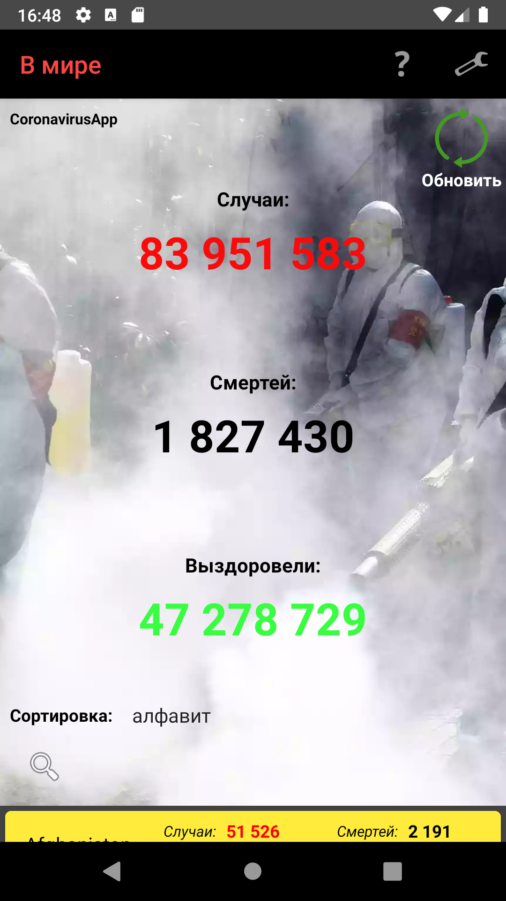
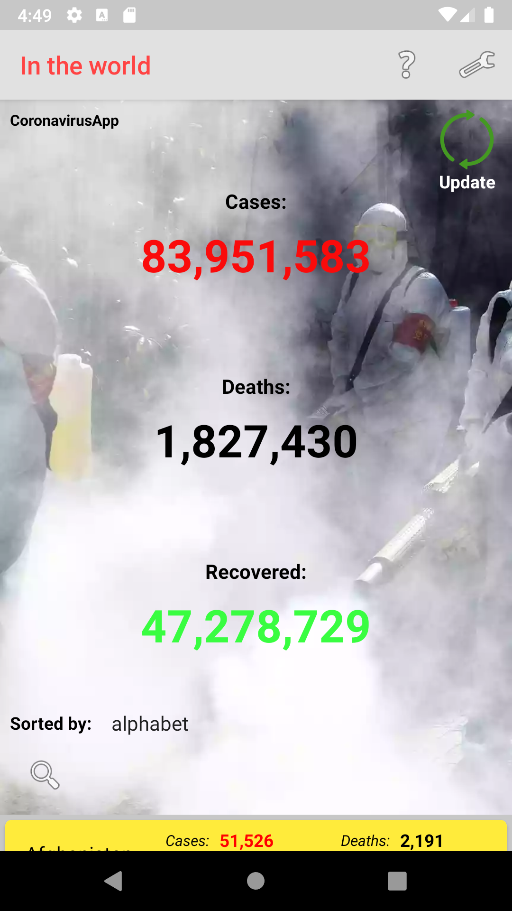
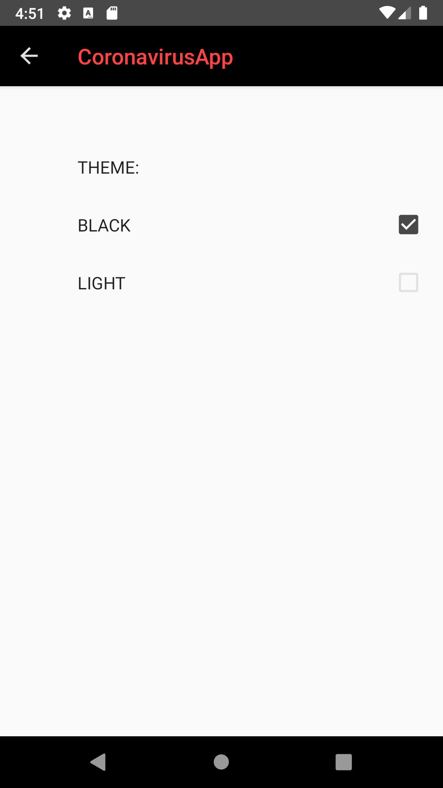
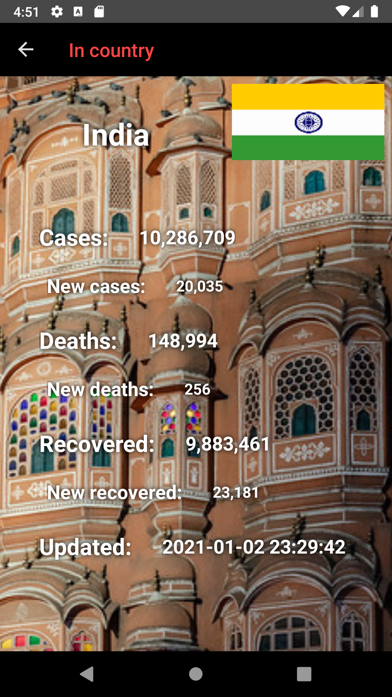
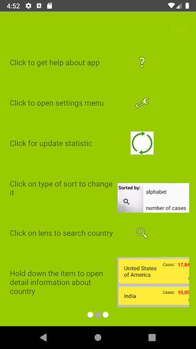

 # Coronavirus App

### **About project:**
##### *As you are all aware coronavirus is one of the most popular problems of modern society. Every day people opening the web sites with corona statistic and look what news, and I’m one of them. One day, I decided to create app with statistic coronavirus.*
...
##### ***At my app, you can see statistic in the world and more detail statistic information about countries. Supports Russian and English languages***
...
### **Technologies:** 
***MVVM**, REST client **retrofit2**, **ROOM** database, **Glide**, static code analyzers **ktlint** and **detekt**, **LiveData**, **Koin**, **Jetpack Navigation**, **Kotlin Coroutines**, **Animation**, **ViewPager2**, **RecyclerView**.*
...
### **Screenshots:**
Main screen day/night:  
   
Settins screen:  
  
Detail screen:  

Help screens:  
         